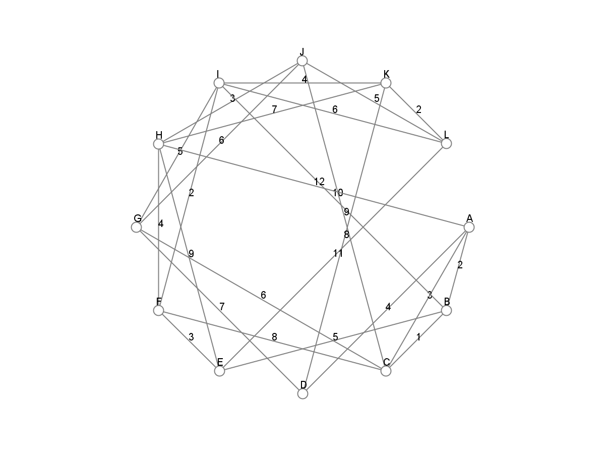
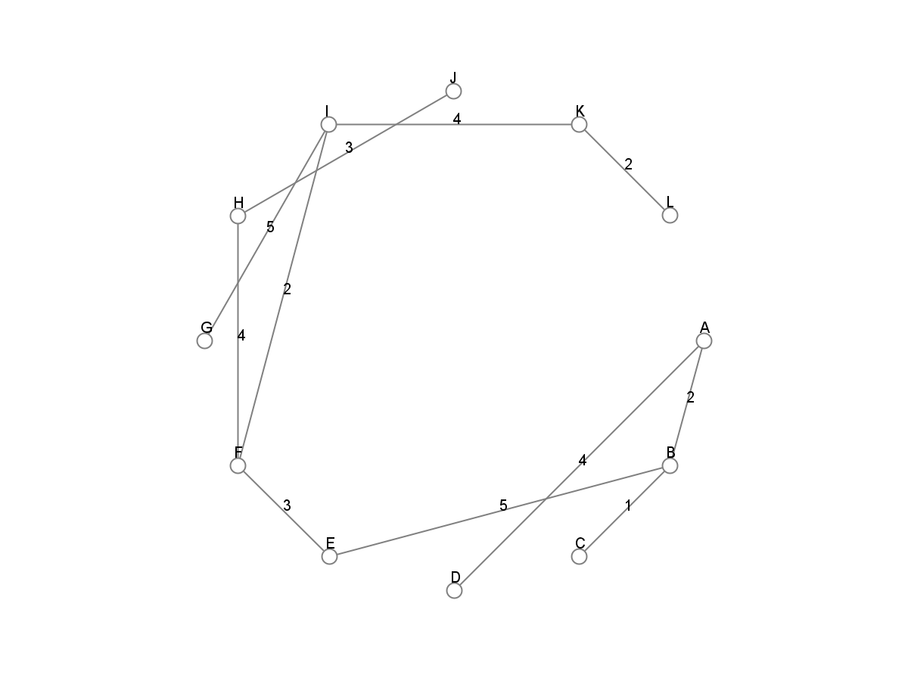
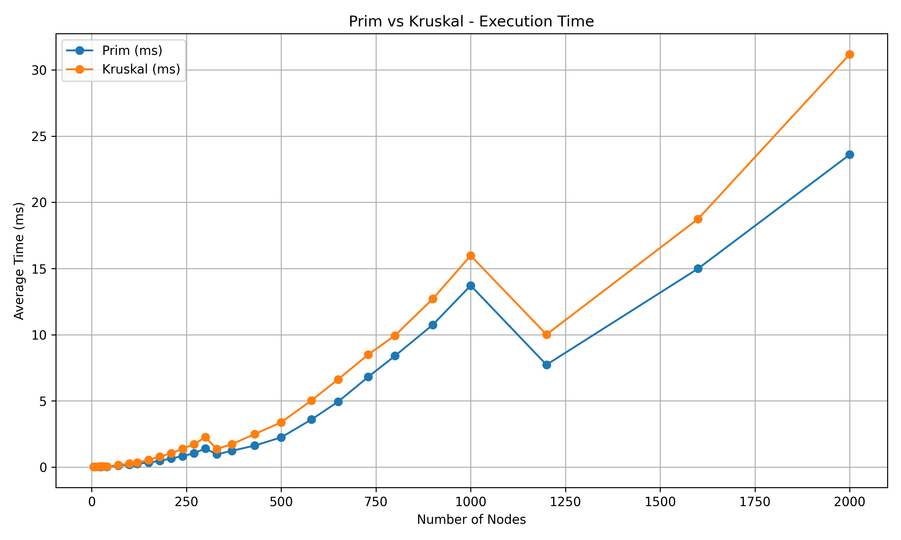
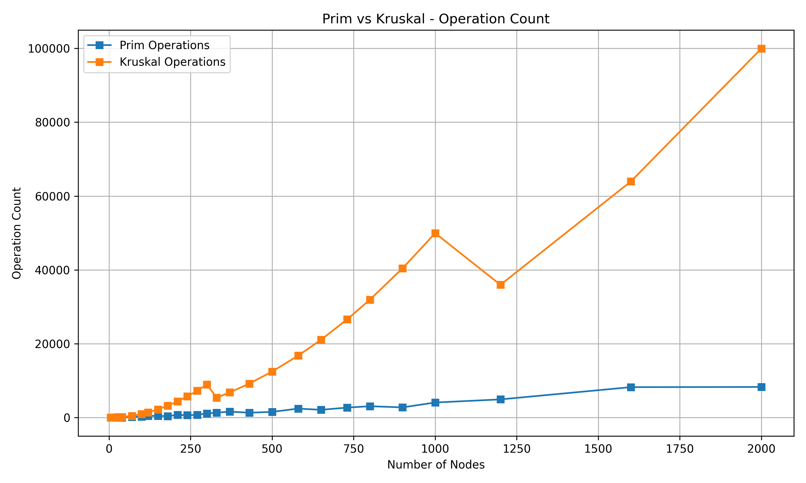

## Objective

The purpose of this assignment is to apply **Prim’s** and **Kruskal’s** algorithms to optimize a city’s transportation network by determining the minimum set of roads that connect all city districts with the lowest possible total construction cost.

---

## Project Structure

```
data/
 ├─ input/
 │   ├─ input.json
 │   └─ input_extralarge.json
 └─ output/
     ├─ benchmark_results.csv
     ├─ result.csv
     ├─ output.json
     └─ plots/         # Plot examples using Graph and Edge datastructures

src/
 ├─ main/java/
 │   ├─ algorithms/     # Prim and Kruskal implementations
 │   ├─ graph/          # Graph and Edge classes
 │   ├─ json/           # JSON reader/writer
 │   ├─ metrics/        # Operation counting and timing
 │   ├─ plots/          # Graph plotting and visualization
 │   └─ Main.java       # Entry point to run algorithms
 └─ test/java/
     ├─ algorithms/     # Unit tests for algorithms
     └─ benchmarks/     # Benchmark tests comparing performance
```

---

## How to Run

### 1. Generate or Edit Input

Graphs are defined in:
```
data/input/input.json
```

Example:
```json
{
  "id": 1,
  "nodes": ["A", "B", "C", "D"],
  "edges": [
    {"from": "A", "to": "B", "weight": 4},
    {"from": "A", "to": "C", "weight": 2},
    {"from": "B", "to": "D", "weight": 5},
    {"from": "C", "to": "D", "weight": 7}
  ]
}
```

---

### 2. Run the Main Program

You can run the program either through **IntelliJ** or **Maven**.

**Option A – IntelliJ IDEA**  
Right-click on `Main.java` then **Run 'Main.main()'**

**Option B – Maven CLI**
```bash
mvn exec:java -Dexec.mainClass="Main"
```

This will:
- Load the graph from `/data/input`
- Compute MST using **Prim** and **Kruskal**
- Save results and MST edges to `/data/output/output.json`

---

## Benchmarking

The benchmark test compares the performance of Prim’s and Kruskal’s algorithms on graphs of increasing size.

**Test class:**
```
src/test/java/benchmarks/BenchmarkTest.java
```

**Output file:**
```
data/output/benchmark_results.csv
```

Example result:
```
GraphID,Nodes,Edges,PrimAvgMs,KruskalAvgMs,PrimOps,KruskalOps
1,10,18,0.0158,0.0153,10,18
2,100,990,0.1776,0.2586,280,990
3,1000,49950,13.7147,15.9720,4100,49950
```

**Column meaning:**
- `PrimAvgMs`, `KruskalAvgMs` – average runtime of Prim’s/Kruskal's algorithm (milliseconds)
- `PrimOps`, `KruskalOps` – operation counts (comparisons, merges, etc.)

---

## Algorithm Analysis

### Prim’s Algorithm
- Builds MST by expanding from an initial vertex.
- Uses a priority queue to select the next smallest edge.
- **Time complexity:** Θ(E log V)
- **Intuition:** Each heap operation costs log V → total E log V.

### Kruskal’s Algorithm
- Sorts all edges by weight and merges disjoint sets.
- **Time complexity:** Θ(E log E) ≈ Θ(E log V)
- **Intuition:** Sorting dominates, while union–find operations are near constant time.

---

## Theoretical vs Practical Comparison

| Aspect                                | Prim’s Algorithm                 | Kruskal’s Algorithm                         |
|:--------------------------------------|:---------------------------------|:--------------------------------------------|
| **Approach**                          | Greedy expansion from one vertex | Greedy merging of disjoint sets             |
| **Best for**                          | Dense graphs                     | Sparse graphs                               |
| **Data structures**                   | Priority queue (heap)            | Disjoint-set (union–find)                   |
| **Complexity**                        | Θ(E log V)                       | Θ(E log V)                                  |
| **Implementation difficulty**         | Moderate                         | Easy                                        |
| **Observed performance (benchmarks)** | Faster on dense graphs           | Slightly slower, especially with many edges |

---

## Graph Visualization

**Class:** `GraphPlotter.java`

Displays and saves graph structures.  
Vertices are placed in a **circular layout** for better readability.

**Example screenshots:**




---

## Benchmark Summary

| Graph | Verticles | Edges | Prim (ms) | Kruskal (ms) | Faster  |
|:------|----------:|------:|----------:|-------------:|:--------|
| 1     |         5 |     4 |    0.0093 |       0.0072 | Kruskal |
| 8     |       100 |   990 |    0.1776 |       0.2586 | Prim    |
| 15    |       300 |  8970 |    1.3989 |       2.2592 | Prim    |
| 25    |      1000 | 49950 |   13.7147 |      15.9720 | Prim    |
| 28    |      2000 | 99950 |   23.6035 |      31.1894 | Prim    |




**Observation:**  
Prim’s algorithm shows consistently better performance as graph density increases.  
Kruskal’s performance drops with large edge counts due to global edge sorting.

---

## Key Files

| File                                  | Purpose                            |
|---------------------------------------|------------------------------------|
| `Main.java`                           | Entry point for running algorithms |
| `Prim.java` / `Kruskal.java`          | MST algorithm implementations      |
| `BenchmarkTest.java`                  | Runs benchmarks and writes CSV     |
| `GraphPlotter.java`                   | Renders and saves graph images     |
| `Metrics.java`                        | Time and operation measurement     |
| `JsonReader.java` / `JsonWriter.java` | Input/output handling              |

---

## Conclusion
Both **Prim’s** and **Kruskal’s** algorithms correctly compute MSTs.  
However:
- **Prim’s** performs better on **dense graphs** and larger datasets.
- **Kruskal’s** is easier to implement and efficient on **sparse graphs**.

In practice, Prim’s algorithm is preferable for large, connected, dense graphs —  
while Kruskal’s is ideal for smaller or sparse networks.